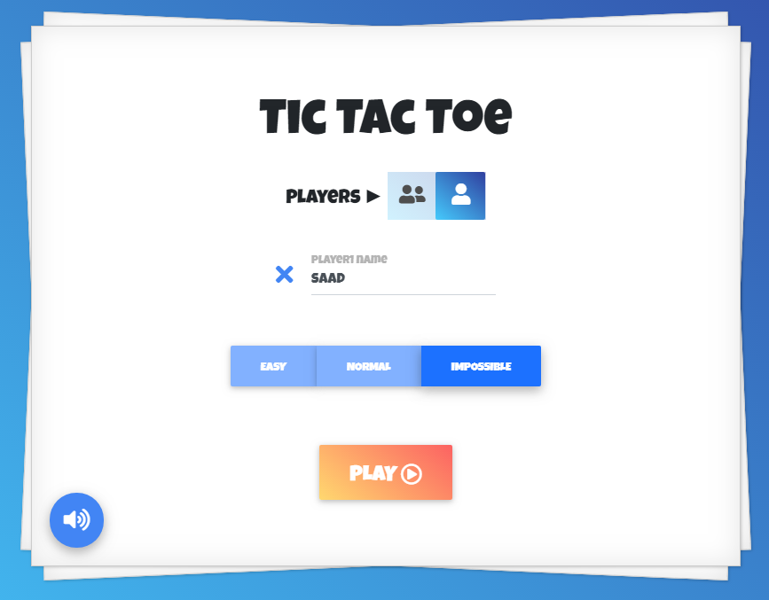
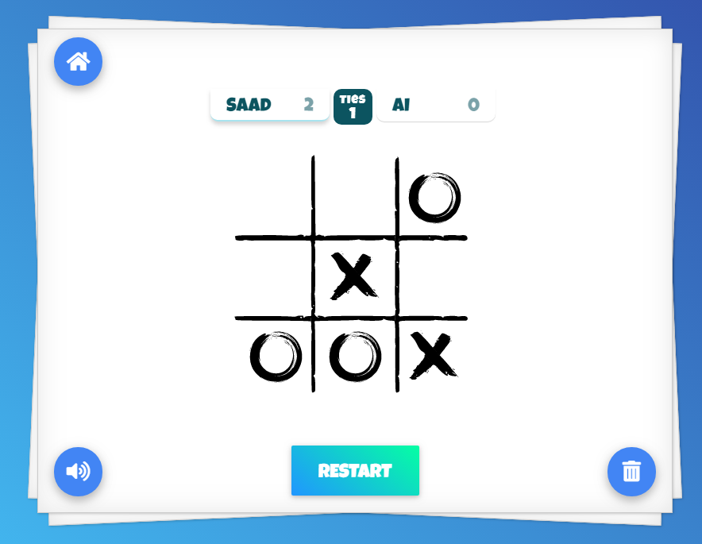

# Tic Tac Toe

A plain JS project. Using the [factory pattern](https://addyosmani.com/resources/essentialjsdesignpatterns/book/#factorypatternjavascript) and the [module pattern](https://addyosmani.com/resources/essentialjsdesignpatterns/book/#modulepatternjavascript) to organize the code.

This is a complete and an awesome **_Tic Tac Toe_** game, fully optimized for _desktop_ and _mobile_, with a great design and all the necessary features you could think of (check [Features](#features) for more details).

**_Artificial Intelligence_**: To create the **_AI_** for this game I used the [Alpha-Beta Pruning](https://www.javatpoint.com/ai-alpha-beta-pruning) algorithm, which is an optimization technique for the [Mini-Max](https://www.javatpoint.com/mini-max-algorithm-in-ai) algorithm, a recursive or backtracking algorithm which is used in decision-making and game theory.

> **Home page**

# 

## Table of contents

1. [Demo](#demo)
2. [Technologies](#technologies)
3. [Features](#features)
4. [Development](#development)

## Demo

Here is the working live demo:
[https://tarhi-saad.github.io/tic-tac-toe/](https://tarhi-saad.github.io/tic-tac-toe/).

## Technologies

- Javascript modules, ES6
- [mdbootstrap](https://mdbootstrap.com): A Material Design UI kit
- The Web Storage API
- [Webpack 4](https://webpack.js.org/)

  

## Features

- Single & multiplayer mode
- Three available difficulties in single player mode (Easy, Normal & Impossible)
- Restart game
- Save and display score
- Reset score
- Add player names & save all your games locally
- Auto & manual switch turns
- Great sound effects
- Material design
- A cartoon game style design
- Cool CSS animations & SVG animations (board game, 'X' & 'O' marks)

> **_Game page_**

# 

## Development

To set up this App locally, clone this repo to your desktop and run `npm install` to install all the dependencies. Then `npm start` to lunch the App.

## License

> You can check out the full license [here](LICENSE)

This project is licensed under the terms of the **GNU GPLv3** license.
